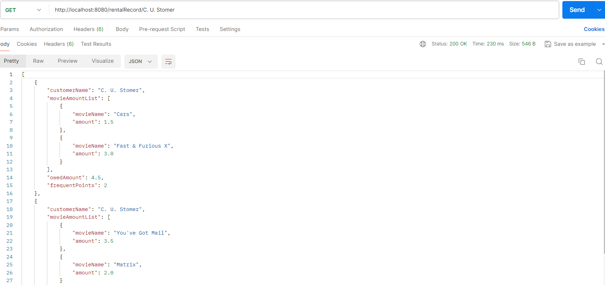

# Information Slip about Movie Rentals

The information slip about movie rentals is responsible for calculating the amount owed for a 
particular movie and the combination of movies for a particular customer. Some rules for
calculating the rental amount are mentioned below:
1. Movie Type: regular
    * Amount owed : For the first 2 days is 2 and for remaining days is days * 1.5
2. Movie Type: new
    * Amount owed: days * 3
3. Movie Type: children
    * Amount owed: For the first 3 days is 1.5 and for remaining days is days * 1.5

# Getting Started

## Steps to run the application
1. Make sure that you are using JDK 17 and your JAVA_HOME is set (..\Java\jdk-17).
2. Make sure the IDE that you are using has JDK 17 set as run configurations.
3. Import movierentals project as a Maven project.
4. Make sure that Maven downloads all the dependencies when the project is first setup.
5. Make sure you have MongoDB installed on your system (https://www.mongodb.com/docs/manual/installation/)
and is up and running. This application uses MongoDB to perform database operations.
6. Run and check the build using command mvn clean install (Maven should be downloaded in your system).
7. Run the main class MovieRentalsApplication where main() method is defined and
   hit the POST API http://localhost:8080/rentalRecord along with the request body
   {
     "name": "C. U. Stomer",
     "rentals": [
       {
         "movieId": "F003",
         "days": 3
       },
       {
         "movieId": "F004",
         "days": 1
       }
     ]
   }

## Approach

1. The first thing I focussed on is to create an entry point for the application and being able
to pass different inputs to the application. Thus, I decided to go ahead with creating REST APIs. 
REST APIs once created can be hit on a network and can be integrated in other applications 
and also can be easily integrated with any UI (Angular, ReactJS etc.).
To setup REST API using Spring Boot I followed the following steps:
* I created a new project from Spring Initializer using Java 17 and included basic dependencies like spring-web.
* I created a main Controller MovieRentalController which will take customer name, movie id,
and number of days to rent the movie and return a response showing the calculated owed amount
by the customer.
* I used the code already given in the assignment in the service method. However, I made some changes
in the code like fixing the equals check for the string. Including the condition of new
movie type in a single if instead of having multiple if statements. Storing the final response
in the DB. 
* I have also created Swagger open API documentation which can be accessed at
http://localhost:8080/swagger-ui.html
* I have written the test cases for controller and service class and have a code coverage of 100%.
* I have attached the postman collection as well along with the solution named MovieRental.postman_collection.json
in the main folder of the project.

## Idea behind implementation
1. Whenever, the user will visit a store to rent a movie, this movie rental application 
can be used for calculation. There will be a UI which will hit the backend service.
The first API that will be called is POST API:
http://localhost:8080/rentalRecord
Find below the screenshot of how this API works:
### Request
The request has customer name and list of movies he/she wants to rent.
The movie information contains movie id and number of days to rent the movie.

### Response
Previously I was returning String in the response as given in the original test case shared.
But having a response structure is preferable as this response structure can be easily used
by the UI to fetch values of owed amount, frequent points and populated on the UI. 
If it was a String the UI had to perform operations to extract these data from the String.
Hence, it is preferable to have a reponse structure which can be further integrated in UI.

### Data in MongoDB Database
Storing the data in DB is essential because when we again come back to the application and see
the data, we would be able to fetch from the DB. If the DB was not integrated in the system,
it wouldn't have been possible to fetch which customer have rented which movies.

The purpose of using a No-SQL DB i.e. MongoDB because the response structure has data as mentioned below:
* private String customerName;
* private List<MovieAmount> movieAmountList;
* private double owedAmount;
* private int frequentPoints;

These data are not structured and also doesn't require operations like JOIN. We simply
want to store the rental records in the DB which will be fetched later to view.

* Database name: movieRentalDB
* Collection Name: rentalRecord

2. The second API that can be used GET all API in which we can fetch rental records of multiple
users.
   

   

The above screenshots shows 3 data currently stored. 2 data are for customer C. U. Stomer
and 1 data is of Jane Doe. 

3. The third API is GET endpoint which fetches the record of a particular user.
   
Here we can see we are getting list of data for the customer C. U. Stomer, it is because
the customer can visit the store multiple times and rent multiple movies. Hence, the
information slip keeps record of all the visits of a particular user. 

## Improvements
The business logic can be improved further in the project.
1. The  "frequentPoints" calculation can be improved. Since we are allowing the same
customer to visit again and rent more movies, we need to make sure the frequentPoints
are calculated correctly. The frequentPoint should be first fetched for the user and the
new frequentPoints should be then added to it. For example, in the above GET endpoint,
since C. U. Stomer has multiple records the frequentPoints should be 2+2 = 4.
2. The map used in service i.e.
   Map<String, Movie> movies = new HashMap<>();
should be stored in Database such that it is not a static list. In order to improve this,
a new controller can be created which can have 2 APIs. The first API is the POST API,
which will store the movie information i.e. movieId, movieName, and code. This API will thus
store this information in database. The second API is the GET API which will fetch
movie information based on movieId from the database and further perform calculations
to generate total amount owed. This way the data doesn't remain static and can be updated
if required using an update PUT API.
3. The business logic can be further extended. For example, currently we are allowing
users to rent movies multiple times and the information is stored in the record.
The functionality can further be extended by creating records to movie rentals that
is returned by the customer. If the customer returns the movies within the number of days 
they rented the movie then no penalty will be there else there can be logic of generating
penalty if customers returned the movie late. Thus, we will have to stored the date-time
when the movie was bought and when the movie was returned.